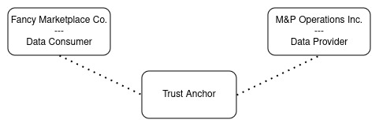
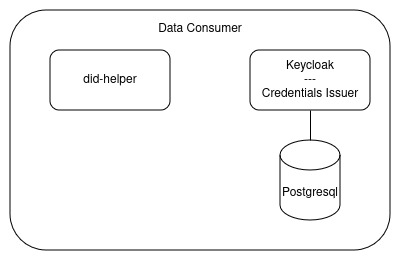
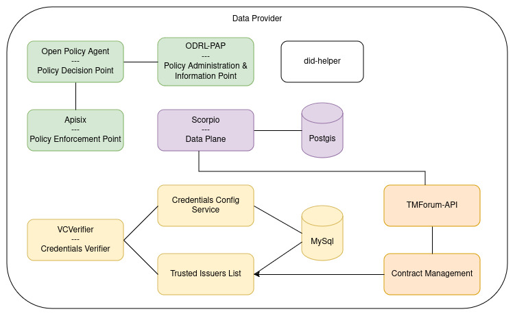

# Local Deployment

In order to support development and exploration of the FIWARE Data Space Connector, a "Minimal Viable Dataspace" is provided as part of this repo.

## Quick Start

> :warning: The local deployment uses [k3s](https://k3s.io/) and is currently only tested on linux. 

To start the Data Space, just use:

```shell
    mvn clean deploy -Plocal
```

Depending on the machine, it should take between 5 and 10min to spin up the complete data space. You can connect to the running k3s-cluster via:

```shell
    export  KUBECONFIG=$(pwd)/target/k3s.yaml
    # get all deployed resources
    kubectl get all --all-namespaces
```

## The Data Space



The locally deployed Data Space consists of 2 Participants, connected through a Trust Anchor.

### The Trust Anchor

Every Data Spaces requires a framework that ensures trust between the participants. Depending on the requirements of the concrete Data Space,
this can become a rather complex topic. Various trust-providers exist(f.e. [Gaia-X Digital Clearing Houses](https://gaia-x.eu/gxdch)) and could be reused, as long as 
they provide an implementation of the [EBSI-Trusted Issuers Registry](https://hub.ebsi.eu/apis/pilot/trusted-issuers-registry/v4) to the participants.

The local Data Spaces comes with the [FIWARE Trusted Issuers List](https://github.com/FIWARE/trusted-issuers-list) as a rather simple implementation of that API, providing CRUD functionality 
for Issuers and storage in an MySQL Database. After deployment, the API is available at ```http://tir.127.0.0.1.nip.io:8080```. Both participants
are automatically registered as "Trusted Issuers" in the registry with their did's.

Get a list of the issuers:
```shell
    curl -X GET http://tir.127.0.0.1.nip.io:8080/v4/issuers
```

A new issuer could for example be registered via:
```shell
  curl -X POST http://til.127.0.0.1.nip.io:8080/issuer \
    --header 'Content-Type: application/json' \
    --data '{
      "did": "did:key:myKey",
      "credentials": []
    }'
```
For more information about the API, see its [OpenAPI Spec](https://github.com/FIWARE/trusted-issuers-list/blob/main/api/trusted-issuers-list.yaml)

## The Participants

The minimal Data Space should provide an easy-to-understand introduction to the FIWARE Data Space. Therefor the roles of the 
participants are clearly seperated into "Data Consumer" and "Data Provider". However, in most real-world Data Spaces the participants 
will have both roles. They are not restricted to either consume or provide.

In our scenario, the Data Provider(`M&P Operations Inc.`) is a company offering solutions to host and operate digital services for other companies. The Data Consumer(`Fancy Marketplace Co.`)
provides a marketplace solution, listing offers from other companies. To fulfill their roles, they need different components of the FIWARE Data Space Connector. 

### The Data Consumer



Since the Data Consumer in our example is only retrieving data, it requires very few components:
* [Keycloak](https://github.com/keycloak/keycloak) - to issue VerifiableCredentials 
* [did-helper](https://github.com/wistefan/did-helper) - a small helper application, providing the decentralized identity to be used for the local Data Space

After deployment, Keycloak can be used to issue VerifiableCredentials for users or services, to be used for authorization at other participants of the Data Space.
It comes with 2 preconfigured users:
* the `keycloak-admin` - has a password generated during deployment, it can be retrieved via ```kubectl get secret -n consumer -o json issuance-secret | jq '.data."keycloak-admin"' -r | base64 --decode```
* the `test-user` - it has a fixed password, set to "test" 

The admin-console of keycloak is available at: ```http://keycloak-consumer.127.0.0.1.nip.io:8080```, login with the `keycloak-admin`
The credentials issuance in the account-console is available at: ```http://keycloak-consumer.127.0.0.1.nip.io:8080/realms/test-realm/account/oid4vci```, login with the `test-user`

In order to retrieve an actual credential two ways are available:
* Use the account-console and retrieve the credential with a wallet. Currently, we cannot recommend any for a local use case.
* Get the credential via http-requests through the `SameDevice-Flow`:

> :warning: The pre-authorized code and the offer expire within 30s for security reasons. Be fast. 

Get an AccessToken from Keycloak:
```shell
    curl -X POST http://keycloak-consumer.127.0.0.1.nip.io:8080/realms/test-realm/protocol/openid-connect/token \
      --header 'Accept: */*' \
      --header 'Content-Type: application/x-www-form-urlencoded' \
      --data grant_type=password \
      --data client_id=admin-cli \
      --data username=test-user \
      --data password=test
```

(Optional, since in the local case we know all of the values in advance)
Get the credentials issuer information:
```shell
    curl -X GET http://keycloak-consumer.127.0.0.1.nip.io:8080/realms/test-realm/.well-known/openid-credential-issuer
```

Get a credential offer uri(for the `user-credential), using the retrieved AccessToken:
```shell
    curl -X GET 'http://keycloak-consumer.127.0.0.1.nip.io:8080/realms/test-realm/protocol/oid4vc/credential-offer-uri?credential_configuration_id=user-credential' \
      --header 'Authorization: Bearer <THE_ACCESS_TOKEN>' 
```

Use the offer uri(e.g. the `issuer`and `nonce` fields), to retrieve the actual offer:
```shell
    curl -X GET '<issuer><nonce>' \
            --header 'Authorization: Bearer <THE_ACCESS_TOKEN>' 
```

Exchange the pre-authorized code from the offer with an AccessToken at the authorization server:
```shell
    curl -X POST http://keycloak-consumer.127.0.0.1.nip.io:8080/realms/test-realm/protocol/openid-connect/token \
      --header 'Accept: */*' \
      --header 'Content-Type: application/x-www-form-urlencoded' \
      --data grant_type=urn:ietf:params:oauth:grant-type:pre-authorized_code \
      --data code=<THE_CODE>
```

Use the returned access token to get the actual credential:
```shell
    curl -X POST http://keycloak-consumer.127.0.0.1.nip.io:8080/realms/test-realm/protocol/oid4vc/credential \
    --header 'Accept: */*' \
    --header 'Content-Type: application/json' \
    --header 'Authorization: Bearer <THE_ACCESS_TOKEN>' \
    --data '{"credential_identifier":"user-credential", "format":"jwt_vc"}'
```

You will receive a jwt-encoded credential to be used within the data space.

### The Data Provider

