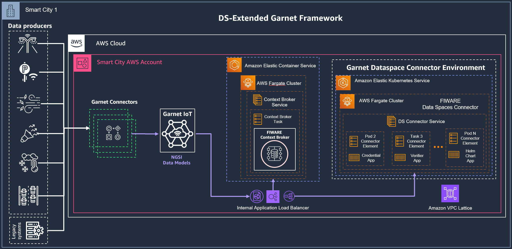

# Integration with AWS Garnet Framework

## Overview

AWS Garnet Framework is an open-source framework aimed at simplifying the creation and operation of interoperable platforms across diverse domains, including Smart Cities, Energy, Agriculture, and more. 
Compliant with the NGSI-LD open standard and harnessing NGSI-LD compliant Smart Data Models, this solution promotes openness and efficiency. 
At its core, AWS Garnet Framework integrates the FIWARE Context Broker, an integral component that facilitates data management. 
[In the official project GitHub repository](https://github.com/aws-samples/aws-stf-core), you'll find the necessary resources to deploy both the FIWARE Context Broker and the Garnet IoT module as separate AWS Cloud Development Kit (CDK) nested stacks, offering a flexible and modular approach to enhance and integrate existing solutions over time.

For the context of Data Spaces, the AWS Garnet Framwork can be extended with the capabilities of the FIWARE Data Spaces Connector, which can instrument an existing deployment of the FIWARE Context Broker, as seen in other examples of this repository.

In this example, the procedure to deploy the packet delivery service provider named IPS on AWS is provided. This deployment pattern can be reused to implement data spaces use cases requiring the infrastructure of the FIWARE Data Spaces Connector.

## Prerequisites

This deployment example focuses on 2 possible initial configurations of infrastructure:

### 1/ No existing AWS Garnet Framework deployment in the AWS Account
For this scenario, it is recommended that the complete Helm Chart for the Data Spaces Connector is deployed to a Kubernetes Cluster in the service Amazon Elastic Kubernetes Service ([AWS EKS](https://aws.amazon.com/eks/)).
In this case, the FIWARE Context Broker will be hosted by a pod in the Kubernetes cluster and the integration to the AWS Garnet Framework will be performed by deploying only the [AWS Garnet IoT module](https://github.com/aws-samples/aws-stf-core#stf-iot) of the framework. Further configuration will include streamlining the Garnet IoT pipeline to the Internal Service Load Balancer associated to the EKS cluster.

<br>


<br>

### 2/ Existing AWS Garnet Framework deployment in the AWS Account with a Context Broker on AWS ECS Fargate

<br>



<br>

## (OPTIONAL) AWS EKS Cluster Creation
If the creation of a dedicated Kubernetes cluster is considered for the deployment of the FIWARE Data Spaces Connector, it is recommended that users follow the instructions to create a new Amazon EKS Cluster available in the [official Amazon EKS Immersion Workshop](https://catalog.workshops.aws/eks-immersionday/en-US/introduction#confirm-eks-setup)

## FIWARE Data Space Connector deployment on AWS EKS using Helm

### AWS EKS Cluster Setup with Fargate Profile

### IPS Service Provider Deployment in Amazon EKS 
This section covers the setup of the prerequisites of the IPS Service Provider examples of this repository, available in [this reference](../service-provider-ips/README.md).

#### IPS Kubernetes namespace creation 

```shell
kubectl create namespace ips
```

#### nginx Ingress Controller Configuration 
<!-- Assuming [nginx-ingress](https://docs.nginx.com/nginx-ingress-controller/) as Ingress Controller -->

In AWS, we use a Network load balancer (NLB) to expose the Ingress-Nginx Controller behind a Service of ```Type=LoadBalancer```. It is advised that the [official Installation Guide is followed for the next steps](https://kubernetes.github.io/ingress-nginx/deploy/#aws)

The provided templates illustrate the setup for legacy in-tree service load balancer for AWS NLB. AWS provides the documentation on how to use Network load balancing on Amazon EKS with AWS Load Balancer Controller.
Network Load Balancer (NLB)

```shell
kubectl apply -f https://raw.githubusercontent.com/kubernetes/ingress-nginx/controller-v1.8.1/deploy/static/provider/aws/deploy.yaml
```

TLS termination in AWS Load Balancer (NLB)

By default, TLS is terminated in the ingress controller. But it is also possible to terminate TLS in the Load Balancer. This section explains how to do that on AWS using an NLB.

* Download the deploy.yaml template

```shell
wget https://raw.githubusercontent.com/kubernetes/ingress-nginx/controller-v1.8.1/deploy/static/provider/aws/nlb-with-tls-termination/deploy.yaml
```

* Edit the file and change the VPC CIDR in use for the Kubernetes cluster:

```shell
proxy-real-ip-cidr: XXX.XXX.XXX/XX
```

##### cert-manager Certificate Manager Configuration
<!-- and [cert-manager](https://cert-manager.io/) being configured to issue certificates 
for domain `*.aws.fiware.io` with ClusterIssuer `letsencrypt-fiware-eks`.  
When using a different Ingress Controller or specific load balancer, make sure to add 
the necessary annotations.  
Also change the domains and hostnames according to your DNS config.
-->

Change the AWS Certificate Manager (ACM) ID as well:

```json
arn:aws:acm:<YOUR-CLUSTER-AWS-REGION>:XXXXXXXX:certificate/XXXXXX-XXXXXXX-XXXXXXX-XXXXXXXX
```

Deploy the manifest:

```shell
kubectl apply -f deploy.yaml
```

