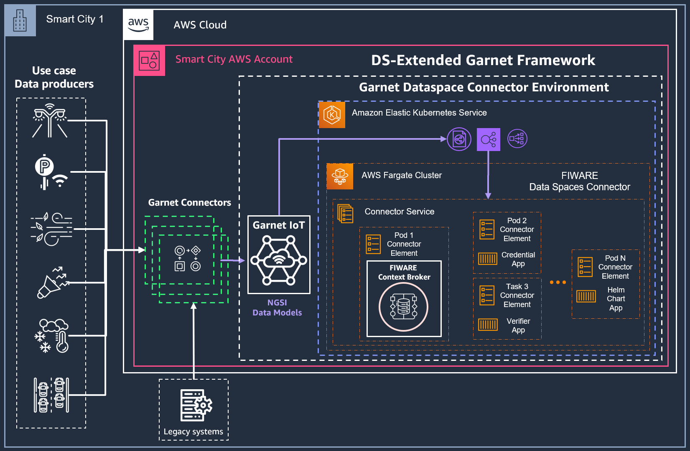

# Integration with AWS Garnet Framework

## Overview

AWS Garnet Framework is an open-source framework aimed at simplifying the creation and operation of interoperable platforms across diverse domains, including Smart Cities, Energy, Agriculture, and more. 
Compliant with the NGSI-LD open standard and harnessing NGSI-LD compliant Smart Data Models, this solution promotes openness and efficiency. 
At its core, AWS Garnet Framework integrates the FIWARE Context Broker, an integral component that facilitates data management. 
[In the official project GitHub repository](https://github.com/aws-samples/aws-stf-core), you'll find the necessary resources to deploy both the FIWARE Context Broker and the Garnet IoT module as separate AWS Cloud Development Kit (CDK) nested stacks, offering a flexible and modular approach to enhance and integrate existing solutions over time.

For the context of Data Spaces, the AWS Garnet Framwork can be extended with the capabilities of the FIWARE Data Spaces Connector, which can instrument an existing deployment of the FIWARE Context Broker, as seen in other examples of this repository.

In this example, the procedure to deploy the packet delivery service provider named IPS on AWS is provided. This deployment pattern can be reused to implement data spaces use cases requiring the infrastructure of the FIWARE Data Spaces Connector.

## Prerequisites

This deployment example focuses on 2 possible initial configurations of infrastructure:

### 1/ No existing AWS Garnet Framework deployment in the AWS Account
For this scenario, it is recommended that the complete Helm Chart for the Data Spaces Connector is deployed to a Kubernetes Cluster in the service Amazon Elastic Kubernetes Service ([AWS EKS](https://aws.amazon.com/eks/)).
In this case, the FIWARE Context Broker will be hosted by a pod in the Kubernetes cluster and the integration to the AWS Garnet Framework will be performed by deploying only the [AWS Garnet IoT module](https://github.com/aws-samples/aws-stf-core#stf-iot) of the framework. Further configuration will include streamlining the Garnet IoT pipeline to the Internal Service Load Balancer associated to the EKS cluster.

 

 

### 2/ Existing AWS Garnet Framework deployment in the AWS Account with a Context Broker on AWS ECS Fargate

 

 

## FIWARE Data Space Connector deployment on AWS EKS using Helm

### AWS EKS Cluster Setup with Fargate Profile

### IPS Service Provider Deployment in Amazon EKS 
This section covers the setup of the prerequisites of the IPS Service Provider examples of this repository, available in [this reference](../service-provider-ips/README.md).

#### IPS Kubernetes namespace creation 

#### nginx Ingress Controller Configuration 
<!-- Assuming [nginx-ingress](https://docs.nginx.com/nginx-ingress-controller/) as Ingress Controller -->

#### cert-manager Certificate Manager Configuration
<!-- and [cert-manager](https://cert-manager.io/) being configured to issue certificates 
for domain `*.aws.fiware.io` with ClusterIssuer `letsencrypt-fiware-eks`.  
When using a different Ingress Controller or specific load balancer, make sure to add 
the necessary annotations.  
Also change the domains and hostnames according to your DNS config.
-->